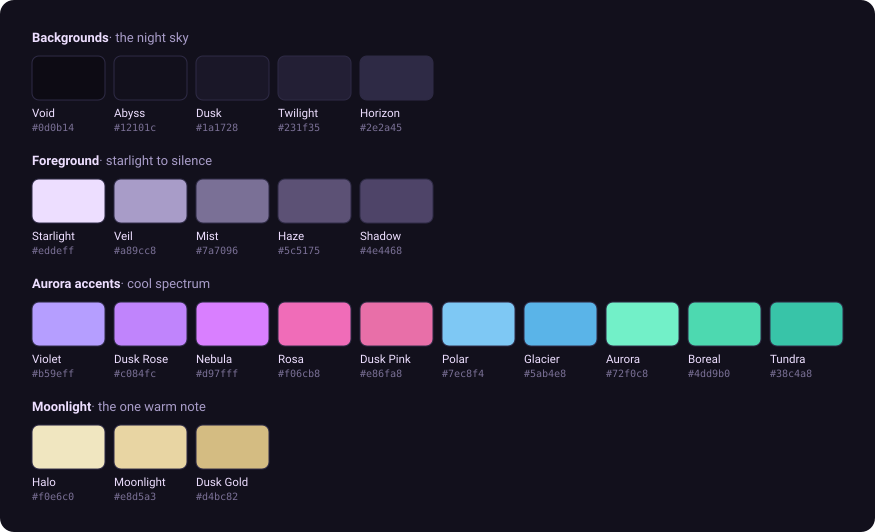

# Rora

> *A cosy, calm dark theme — vivid aurora accents against a deep arctic night.*

Full palette reference · v1 · 23 colours



---

## Backgrounds — the night sky

Five stops from deepest void to visible horizon.

| | Name | Hex | Role |
|--|------|-----|------|
|  | Void | `#0d0b14` | Deepest background · window chrome |
|  | Abyss | `#12101c` | Editor background · main surface |
|  | Dusk | `#1a1728` | Sidebar · panels |
|  | Twilight | `#231f35` | Hover · selection |
|  | Horizon | `#2e2a45` | Active line · borders |

---

## Foreground — starlight to silence

Five steps from primary text down to barely-there.

| | Name | Hex | Role |
|--|------|-----|------|
|  | Starlight | `#eddeff` | Primary text · code |
|  | Veil | `#a89cc8` | Secondary text · labels |
|  | Mist | `#7a7096` | Comments · muted UI |
|  | Haze | `#5c5175` | Disabled · placeholders |
|  | Shadow | `#4e4468` | Line numbers · barely-there |

---

## Aurora accents — cool spectrum

Ten colours spanning the full cool arc — violet through blue-green.

| | Name | Hex | Role |
|--|------|-----|------|
|  | Violet | `#b59eff` | Keywords |
|  | Dusk Rose | `#c084fc` | Operators · punctuation |
|  | Nebula | `#d97fff` | Numbers · constants |
|  | Rosa | `#f06cb8` | Strings |
|  | Dusk Pink | `#e86fa8` | Deprecated · removed |
|  | Polar | `#7ec8f4` | Types · classes |
|  | Glacier | `#5ab4e8` | Links · references |
|  | Aurora | `#72f0c8` | Functions · methods |
|  | Boreal | `#4dd9b0` | Added · success |
|  | Tundra | `#38c4a8` | Variables · decorators |

---

## Moonlight — the one warm note

Soft silver-gold. The moon through arctic clouds. Used sparingly.

| | Name | Hex | Role |
|--|------|-----|------|
|  | Halo | `#f0e6c0` | Moonlight bright · emphasis |
|  | Moonlight | `#e8d5a3` | Warnings · special · cursor option |
|  | Dusk Gold | `#d4bc82` | Moonlight dim · modified |

---

## Semantic aliases — UI states

Palette colours mapped to standard UI meanings. These reuse the colours above
rather than adding new ones.

| | State | Colour | Hex |
|--|-------|--------|-----|
|  | Success | Boreal | `#4dd9b0` |
|  | Warning | Moonlight | `#e8d5a3` |
|  | Error | Rosa | `#f06cb8` |
|  | Info | Polar | `#7ec8f4` |

---

## Core tension

> **Deep, restful darkness** vs **vivid, luminous colour**

The background holds itself. The aurora accents are a gift on top — never load-bearing contrast, always expressive light. If you desaturate Rora to greyscale and it still reads clearly, the palette is working correctly.

---

## Colour naming system

All colours follow the arctic night theme namespace.

**Backgrounds** name the quality of darkness — Void, Abyss, Dusk, Twilight, Horizon.

**Foregrounds** name the quality of light fading — Starlight, Veil, Mist, Haze, Shadow.

**Accents** name arctic and celestial phenomena — Violet, Nebula, Rosa, Polar, Glacier, Aurora, Boreal, Tundra.

**Warm accent** names lunar phenomena — Halo, Moonlight, Dusk Gold.

---

## Variant namespace

Rora is the base dark variant. The naming system supports future variants:

| Name | Concept |
|------|---------|
| **Rora** | Base · the canonical dark theme |
| **Rora Borealis** | More vivid accents · higher saturation |
| **Rora Polaris** | Muted · the one fixed star · stable and calm |
| **Rora Solstice** | The longest night · deepest backgrounds |
| **Rora Equinox** | Balanced · midpoint variant |

---

## Updating the palette

This file is the source of truth. The swatch images and the poster above are
generated from it — after changing a hex value, run:

```bash
python3 scripts/gen-palette-assets.py
```

Then propagate the change to the theme ports under [`apps/`](../apps), which
each hardcode their own copy of the palette. See
[CONTRIBUTING.md](../CONTRIBUTING.md).

---

*Rora — a dark theme for the cosy, the focused, and the permanently night-mode.*
